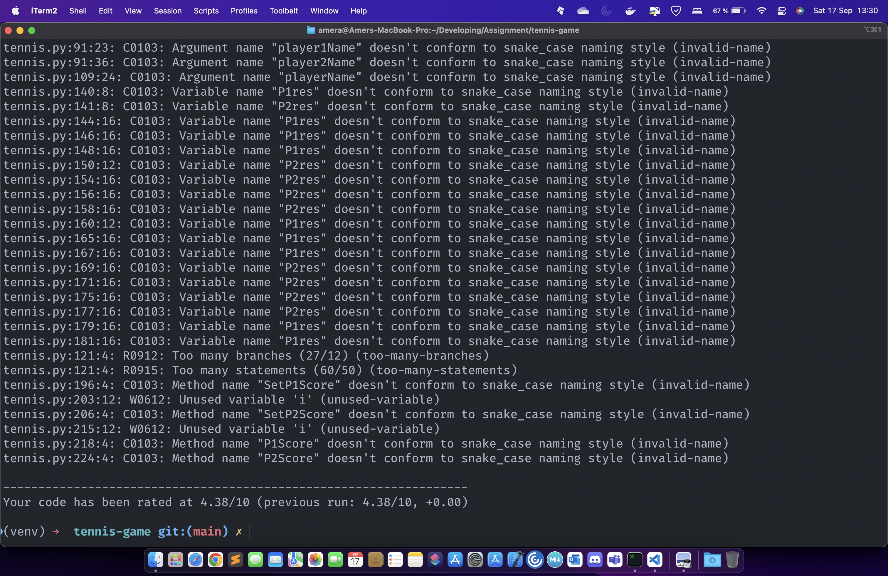
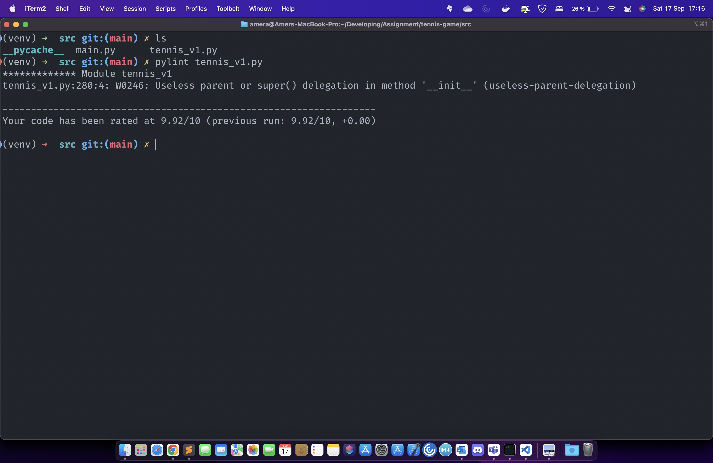

# Tennis-game

This the original file **tennis.py** as documentation, comments and wit test of pylint
down you can see the image.

## Pylint Score from tennis.py

## Tennis_v1

I created Tennis Game version 1.0 with different classes and methods, it has also pylint test.

## Pylint Score from tennis_v1.py

